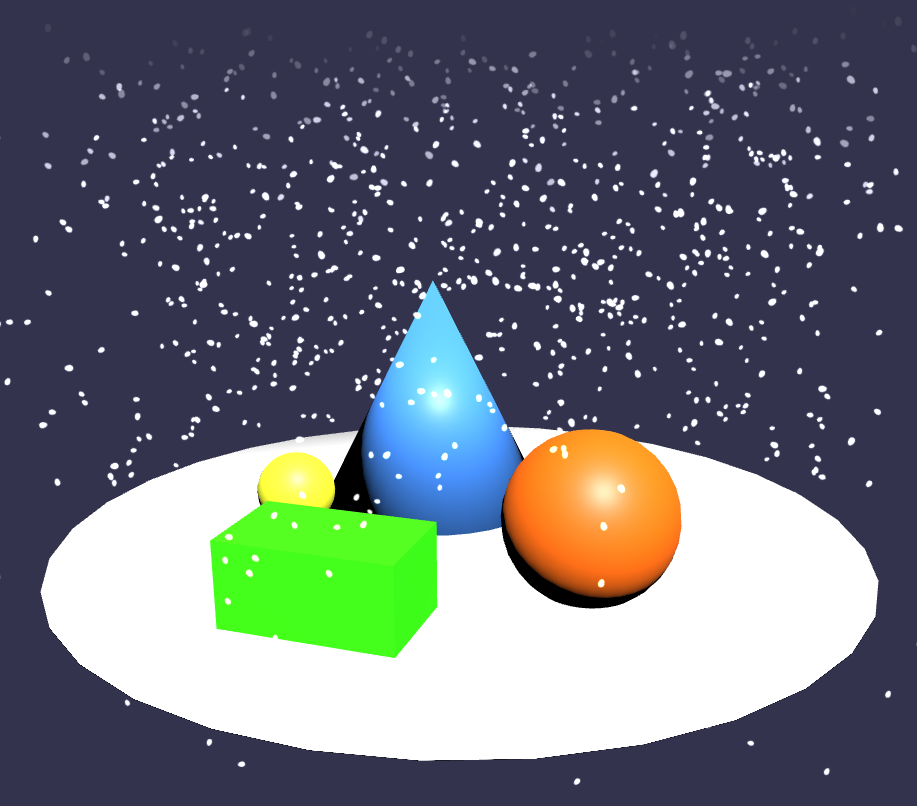

# PGS Final Project

This is my final project submission for the "Procedural Generation and Simulation" course that took place during the summer term 2019.



## Project goals

The project goal was to apply any of the lecture topics in a practical (software) project. I chose to use a particle system for stylized snow simulation.

## How to build and run

Building this project requires Node.js and NPM to build. With the repository checked out, change into the project directory and run

```.sh
npm install
npm run build
```

This creates a _bundle.js_ file. You can then serve the project directory with a HTTP server. Load the index.html in a browser. You should see a fullscreen 3D scene. Use the mouse to pan around the scene, scroll to zoom in and out.
